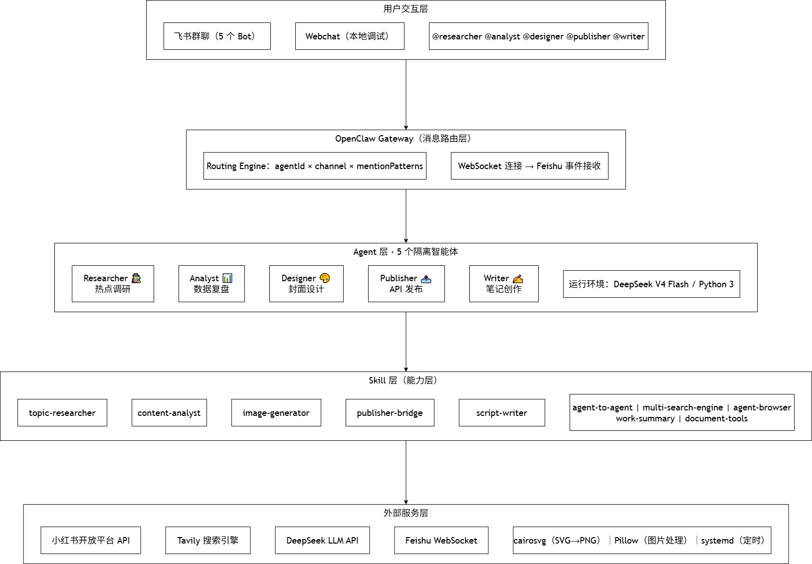

# 文案内容创作与发布助手 

## 项目名称
一句话说明项目是什么：AI 驱动的文案内容创作与发布全流程自动化助手

## 项目概述
本项目旨在为内容创作者提供从选题调研、内容创作到发布管理的全流程自动化解决方案。通过多智能体协作模式，实现热点追踪、文案生成、封面设计和平台发布的一站式服务，帮助创作者提升内容生产效率和质量。系统支持单平台深度运营，聚焦笔记类内容创作场景，兼顾创作效率与内容质量。

## 功能特性
- **选题调研**：自动抓取热搜关键词、分析爆款笔记结构、挖掘领域热词
- **内容创作**：基于选题生成符合平台规范的正文、多风格标题和话题标签
- **视觉设计**：根据笔记内容自动生成适配平台的 3:4 竖版封面图
- **发布管理**：支持 API 一键发布和定时发布功能，自动添加话题标签
- **智能协作**：多 Agent 分工协作，实现全流程自动化任务流水线
- **状态追踪**：所有任务状态可查，操作日志完整可追溯

## 系统架构
### 系统分层架构



### Agent 分工与交互流程
| Agent 名称 | 职责 | 输入 | 输出 | 交互流程 |
|-----------|------|------|------|----------|
| Researcher | 热点调研、爆款笔记分析、关键词挖掘 | 选题关键词 | 热点简报 + 爆款分析 | → Analyst |
| Analyst | 爆款拆解 + 选题评级（S/A/B/C） | 热点简报 | commend-notes.md, topic-suggest.md | → Writer |
| Writer | 笔记正文创作、标题优化、文案风格适配 | Researcher简报 | 笔记正文 + 标题 + 标签 | → Designer |
| Designer | 封面图生成、配图排版、视觉风格统一 | 笔记主题 + 文案 | 封面图.png | → Publisher |
| Publisher | API发布、定时发送、标签话题管理 | 文案 + 封面 | 发布确认 + 链接 | → Analyst（数据反馈） |

**消息格式规范**
- Researcher → Analyst：热点简报（JSON格式）
- Analyst → Writer：选题分析报告 + 爆款笔记拆解（JSON格式）
- Writer → Designer：笔记主题 + 文案（文本格式）
- Designer → Publisher：封面图.png + 文案（文件+文本）
- Publisher → Analyst：发布记录（JSON格式）
- Analyst → Researcher：数据报告（JSON格式）

## 技术栈
### 大模型
- **DeepSeek V4 Flash**：核心推理引擎，中文能力强，响应速度快
- **Moonshot Kimi**：兜底备用模型，支持超长上下文处理

### 开发平台
- **飞书**：消息协作平台，支持多 Bot 部署和 @ 触发
- **Node.js**：后端开发语言，v24.0.0 或更高版本
- **OpenClaw**：多智能体协作框架

### 工具依赖
- **Web Search/Fetch**：热点数据采集
- **SVG/PNG 生成**：封面图设计
- **API 调用**：平台发布功能

### 数据存储
- Agent 协作数据：collab/ 目录（.md 格式）
- 笔记文案：output/notes/ 目录（.md 格式）
- 封面图：output/covers/ 目录（.png 格式）
- 配置文件：openclaw.json（JSON 格式）

## 快速开始
### 环境要求
- Node.js: v24.0.0 或更高版本
- 操作系统: Ubuntu 24.04 (WSL2) / Linux / macOS
- 内存: 8GB 以上（推荐 16GB）
- 存储: 至少 20GB 可用空间

### 安装步骤
```bash
# 克隆仓库到本地
git clone https://github.com/u-zjn/openclaw.git

# 安装项目依赖
npm install

# 全局安装 OpenClaw CLI
npm install -g openclaw-cli
```

### 配置说明
```bash
# 备份默认配置
cp openclaw.json openclaw.json.backup

# 编辑配置文件（需填入 API Key 等信息）
vim openclaw.json
```

**关键配置项**：
```json
{
  "gateway": {
    "port": 3000,
    "logLevel": "info"
  },
  "agents": {
    "researcher": {
      "enabled": true,
      "apiKey": "YOUR_DEEPSEEK_API_KEY"
    },
    "analyst": {
      "enabled": true,
      "apiKey": "YOUR_DEEPSEEK_API_KEY"
    },
    "writer": {
      "enabled": true,
      "apiKey": "YOUR_DEEPSEEK_API_KEY"
    },
    "designer": {
      "enabled": true,
      "apiKey": "YOUR_DEEPSEEK_API_KEY"
    },
    "publisher": {
      "enabled": true,
      "zhihuCookie": "YOUR_ZHIHU_COOKIE"
    }
  }
}
```

### 运行命令
```bash
# 启动 OpenClaw Gateway
openclaw gateway start

# 启动所有 Agent
openclaw agent start all

# 执行全流程测试
openclaw pipeline run full --input "领域关键词: 科技"
```

## 项目结构
```
workspace/
├── analyst/               # Analyst Agent 目录
│   ├── AGENTS.md          # Agent 配置文件
│   ├── MEMORY.md          # Agent 记忆数据
│   └── SOUL.md            # Agent 核心逻辑
├── designer/              # Designer Agent 目录
│   ├── AGENTS.md          
│   ├── MEMORY.md          
│   └── SOUL.md            
├── publisher/             # Publisher Agent 目录
│   ├── AGENTS.md          
│   ├── MEMORY.md          
│   └── SOUL.md            
├── researcher/            # Researcher Agent 目录
│   ├── AGENTS.md          
│   ├── MEMORY.md          
│   └── SOUL.md            
├── writer/                # Writer Agent 目录
│   ├── AGENTS.md          
│   ├── MEMORY.md          
│   └── SOUL.md            
├── skills/                # 技能库目录
│   ├── analyst/           # Analyst 技能实现
│   │   ├── __tests__/     # 测试用例目录
│   │   ├── README.md      # 技能说明文档
│   │   ├── index.ts       # 技能入口文件
│   │   ├── types.ts       # 类型定义文件
│   │   └── utils.ts       # 工具函数文件
│   ├── designer/          # Designer 技能实现
│   │   ├── __tests__/     
│   │   ├── README.md      
│   │   ├── index.ts       
│   │   ├── types.ts       
│   │   └── utils.ts       
│   ├── researcher/    # 热点调研技能实现
│   │   ├── __tests__/     
│   │   ├── README.md      
│   │   ├── index.ts       
│   │   ├── types.ts       
│   │   └── utils.ts       
│   ├── publisher/         # Publisher 技能实现
│   │   ├── __tests__/     
│   │   ├── README.md      
│   │   ├── index.ts       
│   │   ├── types.ts       
│   │   └── utils.ts       
│   └── writer/            # Writer 技能实现
│   │   ├── __tests__/     
│   │   ├── README.md      
│   │   ├── index.ts       
│   │   ├── types.ts       
│   │   └── utils.ts       
├── API.md                 # API 接口文档
├── README.md              # 项目说明文档
├── gantt_chart.png        # 甘特图
└── 架构图.png              # 系统架构图
```

## 已知问题
---

## 1. 集成依赖类问题

| # | 问题 | 影响 | 优先级 | 状态 |
|:-:|:-----|:----:|:------:|:----:|
| 1 | **微博热搜 API 稳定性** — `weibo.com/ajax/side/hotSearch` 为公开接口，无 SLA 保障，可能因微博平台调整而失效 | 中 | 🟡 P2 | 待观察 |
| 2 | **DeepSeek API 配额限制** — 使用个人 API Key，有调用频率和额度限制，高峰期可能限流 | 中 | 🟡 P2 | 待观察 |
| 3 | **无备用模型自动切换** — Kimi 模型已配置但未实现自动降级切换，DeepSeek 不可用时手动切换 | 低 | 🟢 P3 | 待补充 |

## 2. 功能缺失类问题

| # | 问题 | 影响 | 优先级 | 状态 |
|:-:|:-----|:----:|:------:|:----:|
| 4 | **缺少端到端集成测试** — 现有测试覆盖了单元和模块集成，但缺少完整的 Researcher→Analyst→Writer→Designer→Publisher 全链路模拟测试 | 中 | 🟡 P2 | 待补充 |
| 5 | **Agent 状态可视化** — 缺少统一的 dashboard 查看 5 Agent 实时状态、任务进度、错误日志 | 低 | 🟢 P3 | 待开发 |
| 6 | **定时发布任务持久化** — 当前定时发布依赖系统 crontab / gateway cron，无独立的持久化任务队列 | 低 | 🟢 P3 | 待补充 |
| 7 | **发布失败通知** — Publisher 发布失败时仅在日志记录，没有主动通知机制（如飞书消息告警） | 低 | 🟢 P3 | 待补充 |
| 8 | **Agent 自动恢复** — Agent 崩溃后需要手动重启，没有自动恢复机制 | 低 | 🟢 P3 | 待补充 |

## 3. 安全类问题

| # | 问题 | 影响 | 优先级 | 状态 |
|:-:|:-----|:----:|:------:|:----:|
| 9 | **Cookie 明文存储** — 知乎 Cookie 以明文存储在 `output/zhihu-credentials.json`，文件权限建议设为 600 | 中 | 🟡 P1 | 待配置 |
| 10 | **环境变量未统一** — API Key 分散在 `openclaw.json` 和 `.bashrc` 中，建议统一到 `.env` 文件 | 低 | 🟢 P3 | 待优化 |
| 11 | **缺少 exec 命令审计** — Publisher 的 exec 操作记录在 gateway logs 中，但没有独立的 exec 审计日志文件 | 低 | 🟢 P3 | 待补充 |

## 4. 代码质量类问题

| # | 问题 | 影响 | 优先级 | 状态 |
|:-:|:-----|:----:|:------:|:----:|
| 12 | **Skill 测试覆盖不全** — analyst（1 用例）、publisher（5 用例）测试用例数较少，核心逻辑路径覆盖不足 | 中 | 🟡 P2 | 待补充 |
| 13 | **错误处理测试** — collab-core 的 pipeline.ts 中 `withRetry` 的退避睡眠（5s/10s/15s）在测试中触发超时，当前使用 mock 绕过，未测试真实退避逻辑 | 低 | 🟢 P3 | 待优化 |
| 14 | **TypeScript 类型严格度** — 部分代码使用了 `any` 类型（如消息 payload），未达到 Strict 模式 | 低 | 🟢 P3 | 待优化 |
| 15 | **README 文档不完整** — 部分 Skill 缺少 README（如 analyst），或 README 内容与实际实现不一致 | 低 | 🟢 P3 | 待补充 |

## 5. 部署运维类问题

| # | 问题 | 影响 | 优先级 | 状态 |
|:-:|:-----|:----:|:------:|:----:|
| 16 | **WSL2 环境依赖** — 当前运行在 WSL2 环境中，agent-browser 的 Chrome 需要显示环境，无图形界面的服务器无法直接运行 | 中 | 🟡 P2 | 待容器化 |
| 17 | **Docker 镜像未测试** — Dockerfile 和 docker-compose.yml 已编写但未验证构建和运行 | 中 | 🟡 P2 | 待测试 |
| 18 | **Node.js 版本绑定** — 代码依赖 Node.js v24 特性，低版本不兼容 | 低 | 🟢 P3 | 待说明 |
| 29 | **无 CI/CD 流水线** — 缺少自动化构建、测试、部署流水线 | 低 | 🟢 P3 | 待搭建 |

## 6. 设计决策约束

| # | 决策 | 原因 | 影响 |
|:-:|:-----|:------|:------|
| 20 | **不使用 API 加签鉴权** — 知乎 API 使用 Cookie 而非标准的 OAuth2 Token，Cookie 有失效风险 | 🟡 P2 |
| 21 | **不使用数据库** — 所有 Agent 协作通过文件系统 `collab/` 目录完成，无事务性保障 | 🟢 P3 |
| 22 | **不使用消息队列** — Agent 之间直接文件读写，非异步消息驱动 | 🟢 P3 |

---

## 优先级说明

| 等级 | 含义 | 响应时间 |
|:----:|:-----|:--------:|
| 🔴 P0 | 阻断性问题，必须立即修复 | 24h |
| 🟡 P1 | 严重问题，影响核心功能 | 72h |
| 🟡 P2 | 中等问题，功能受限 | 1周 |
| 🟢 P3 | 低优先级，可后续优化 | 2周+ |


## 团队信息
| 成员姓名 | 分工 |
| -------- | ---- |
| 马松月   | 项目经理兼架构师：需求管理、进度跟踪、对外沟通、系统架构设计、Agent 分工、技术选型 |
| 张家诺   | 开发工程师：Skill 编码、Agent 配置、集成联调 |
| 关雅馨   | 文档/测试：文档编写、测试用例、Demo 准备 |

---

**文档版本**: v2.0
**最后更新**: 2026-07-20
**维护团队**: 文案内容创作与发布助手团队
