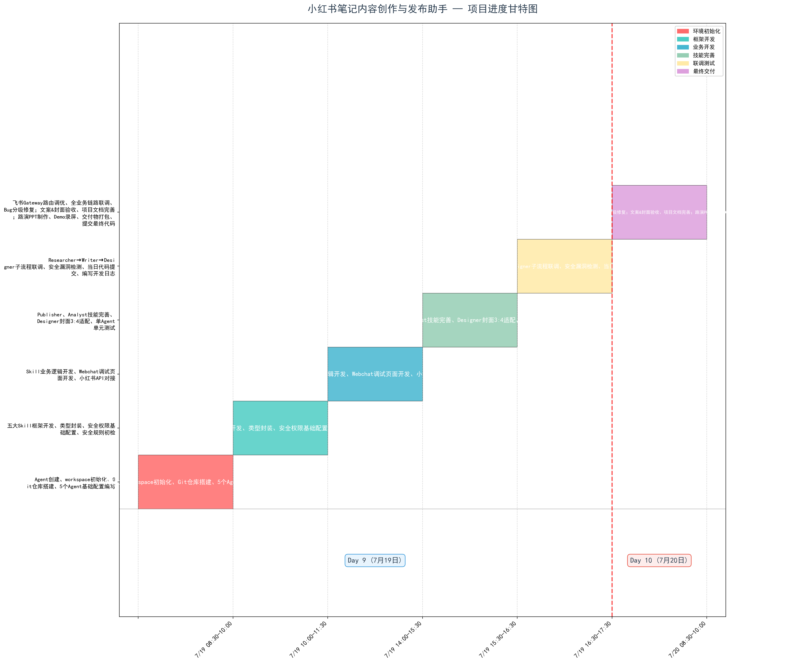

# 文案内容创作与发布助手 

## 第一章 团队信息

| 成员姓名 | 角色职责                                                     |
| -------- | ------------------------------------------------------------ |
| 马松月   | 项目经理兼架构师：需求管理、进度跟踪、对外沟通、系统架构设计、Agent 分工、技术选型 |
| 张家诺   | 开发工程师：Skill 编码、Agent 配置、集成联调                 |
| 关雅馨   | 文档/测试：文档编写、测试用例、Demo 准备                     |

## 第二章 需求分析

### 2.1 用户故事

| ID | 标题 | 故事描述 |
|:--:|:----:|:--------:|
| US-01 | 热点追踪 | 作为创作者，我希望 AI 自动抓取热搜和领域热门笔记，以便快速确定选题方向 |
| US-02 | 笔记正文生成 | 作为创作者，我希望输入关键词就能生成完整的正文（含 emoji、排版），以便减少写作时间 |
| US-03 | 标题优化 | 作为创作者，我希望 AI 生成 3-5 个风格的标题，以便提高点击率 |
| US-04 | 封面生成 | 作为创作者，我希望 AI 根据笔记内容自动生成封面图（适配 3:4 竖版），以便提升视觉吸引力 |
| US-05 | 标签话题推荐 | 作为创作者，我希望 AI 推荐相关话题标签和关键词，以便获得更多流量推荐 |
| US-06 | 定时发布 | 作为创作者，我希望设定时间后 AI 通过 API 自动发布，以便利用流量高峰 |
| US-07 | 数据复盘 | 作为创作者，我希望查看每篇笔记的阅读/点赞/收藏/评论数据和改进建议 |
| US-08 | 系列笔记 | 作为创作者，我希望一次输入一个主题，AI 批量产出 3-5 篇系列笔记 |
| US-09 | 多图配文 | 作为创作者，我希望上传多张素材图后 AI 自动排版生成图文笔记 |
| US-10 | 评论管理 | 作为创作者，我希望 AI 辅助回复评论区高频问题 |

### 2.2 MoSCoW 功能列表

#### Must Have

| 模块 | 功能 | 说明 |
|:----:|:----:|:-----:|
| 选题调研 | 热搜采集 | 抓取热搜词、领域热门笔记 |
| | 爆款笔记分析 | 分析爆款笔记的结构、标题模式、标签组合 |
| | 关键词挖掘 | 输入领域词，输出关联热词 |
| 笔记创作 | 正文生成 | 按「标题 + 正文 + emoji + 话题标签」结构输出 |
| | 标题生成 | 生成 3-5 个风格标题 |
| | 正文适配 | 适配 500 字限制，段落 ≤ 5 行 |
| 发布引擎 | API 发布 | 通过开放平台 API 发布笔记 |
| | 定时发布 | 设定具体时间到点自动发布 |
| | 话题标签 | 自动添加推荐话题标签 |
| 智能体协作 | 任务流水线 | Researcher → Writer+Designer → Publisher 全链路 |
| | 状态追踪 | 每个任务状态可查 |
| 基础架构 | Agent 注册与路由 | 5 个 Agent 的注册和路由 |
| | 日志审计 | 所有操作可追溯 |

#### Should Have

| 模块 | 功能 | 说明 |
|:----:|:----:|:-----:|
| 数据复盘 | 笔记数据拉取 | 读取阅读量/点赞/收藏/评论/分享数据 |
| | 流量分析 | 分析流量来源比例 |
| | 优化建议 | 基于数据给出选题建议 |
| 创作辅助 | 爆款拆解 | AI 分析结构和亮点 |
| | 多图排版 | 多张图片自动排序配文 |
| 审核流程 | 发布前预览 | 模拟信息流展示效果 |
| | 一键发布 | 审核通过后发布 |
| 封面设计 | 封面图生成 | SVG 生成 3:4 竖版封面 |
|  | 文字叠加 | 封面叠加标题文字 |

#### Could Have

| 功能 | 说明 |
|:----:|:-----:|
| 批量生成系列笔记 | 输入主题，批量产出 7 天笔记规划 |
| 评论区管理 | AI 辅助回复评论 |

#### Won't Have

| 功能 | 理由 |
|:----:|:-----:|
| 多平台适配 | 本次专注单平台 |
| 直播管理 | 直播与笔记是不同场景 |
| 私信自动化 | 涉及用户隐私 |
| 电商带货 | 超出笔记范围 |
| 原生 App | 优先飞书交互 |

### 2.3 验收标准

#### 基础架构

| 编号 | Given | When | Then |
|:-----|:------|:------|:------|
| AC-01 | 已配置 Researcher、Writer、Designer、Publisher、Analyst 五个 Agent | 执行 openclaw agents list | 输出中包含全部 5 个 Agent，状态均为 running |
| AC-02 | 任一 Agent 运行异常（如超时、模型调用失败） | 查看 openclaw gateway logs | 日志中包含对应 Agent 的错误记录、时间戳和错误类型 |
| AC-03 | Publisher 调用 API 发布笔记 | API 返回 5xx 服务端错误 | 系统自动重试最多 3 次，每次间隔 30 秒，并在日志中记录每次重试 |

#### 选题调研

| 编号 | Given | When | Then |
|:-----|:------|:------|:------|
| AC-R1 | Researcher 接收到选题调研指令，关键词为"穿搭" | Agent 完成热搜采集 | 输出 hot-topics.md，包含多条热搜词，每条含热度指数、来源、采集时间戳 |
| AC-R2 | Researcher 接收到爆款分析指令，附 1 个笔记链接 | Agent 完成分析 | 输出 competitor-notes.md，含标题、封面风格描述、正文结构分析、高频标签列表 |
| AC-R3 | 定时任务已配置 | 24 小时后检查 | 输出目录中有当日新生成的热点简报文件 |

#### 笔记创作

| 编号 | Given | When | Then |
|:-----|:------|:------|:------|
| AC-W1 | Writer 接收到 Researcher 的热点简报 | 触发"生成笔记正文"指令 | 在 60 秒内输出 note-content.md，且文件不为空 |
| AC-W2 | Writer 完成笔记正文生成 | — | 正文总字数 ≤ 500 字，且每个段落 ≤ 5 行 |
| AC-W3 | Writer 完成笔记正文生成 | 扫描正文内容 | 检测 emoji 字符，且分布在不同段落中 |
| AC-W4 | Writer 接收到选题信息 | 执行标题生成 | 输出 titles.md，包含符合风格不同的标题（数字型、悬念型、反问型等） |
| AC-W5 | Writer 完成笔记正文 | 执行标签推荐 | 输出 hashtags.md，包含 3-5 个相关话题标签 |

#### 封面设计

| 编号 | Given | When | Then |
|:-----|:------|:------|:------|
| AC-D1 | Designer 接收到笔记主题和标题 | 执行封面生成 | 输出封面图比例为 3:4，格式为 .png |
| AC-D2 | Designer 完成封面图生成 | 检查封面图 | 图片叠加了笔记标题文字 |

#### 发布引擎

| 编号 | Given | When | Then |
|:-----|:------|:------|:------|
| AC-P1 | Publisher 接收到完整的笔记正文和封面图 | 调用开放平台 createnote API | API 返回 200 状态码，且返回笔记 ID 和编辑链接 |
| AC-P2 | 设置发布时间为 T 时刻 | 系统触发发布 | 实际发布时间与 T 时刻的差值 ≤ 2 分钟 |
| AC-P3 | Publisher 完成发布 | — | 输出 publish-log.md，含笔记标题、发布时间、编辑链接 |

#### 数据复盘

| 编号 | Given | When | Then |
|:-----|:------|:------|:------|
| AC-A1 | Analyst 接收到发布记录 | 执行数据采集 | 输出包含阅读量、点赞数、收藏数、评论数、分享数五项指标 |
## 第三章 系统架构设计

### 3.1 系统分层架构

### 3.2 Agent 详细设计表
| Agent 名称 | 职责 | 输入 | 输出 | 设计原则 |
|-----------|------|------|------|----------|
| Researcher | 热点调研、爆款笔记分析、关键词挖掘 | 选题关键词 | 热点简报 + 爆款分析 | 专注内容调研分析 |
| Writer | 笔记正文创作、标题优化、文案风格适配 | Researcher简报 | 笔记正文 + 标题 + 标签 | 专注内容创作 |
| Designer | 封面图生成、配图排版、视觉风格统一 | 笔记主题 + 文案 | 封面图.png | 专注视觉设计 |
| Publisher | API发布、定时发送、标签话题管理 | 文案 + 封面 | 发布确认 + 链接 | 专注发布管理 |
| Analyst | 笔记数据追踪、流量复盘、优化建议 | 发布记录 | 数据报告 | 专注数据分析 |

## Agent间消息格式规范
- **Researcher → Writer**: 热点简报（JSON格式）
- **Writer → Designer**: 笔记主题 + 文案（文本格式）
- **Designer → Publisher**: 封面图.png + 文案（文件+文本）
- **Publisher → Analyst**: 发布记录（JSON格式）
- **Analyst → Researcher**: 数据报告（JSON格式）

### 3.3 Skill 接口定义

| Skill | 用途 | 输入 | 输出 | 负责 Agent | 依赖工具 |
|:-----:|:----:|:----:|:----:|:----------:|:--------:|
| agent-to-agent | Agent 文件接力 | 任务文件路径 | collab 接力文件 | 全部 | read, write, edit |
| image-generator | SVG 封面图生成 | 主题描述 + 尺寸 | 封面图 .png | Designer | write, exec |
| multi-search-engine | 多引擎热点采集 | 关键词 + 平台 | 搜索结果报告 | Researcher  Analyst | web_search, web_fetch |
| agent-browser | 网页内容提取 | URL | 结构化页面内容 | Researcher | exec |
| topic-researcher | 热搜 + 爆款分析 + 关键词 | keyword, platform | hot-topics.md, competitor-notes.md, keyword-plan.md | Researcher | web_search, web_fetch, read, write |
| script-writer | 笔记创作 + 标题 + emoji + 标签 | topic, style, ref_notes | note-content.md, titles.md, hashtags.md | Writer | read, write, edit |
| publisher-bridge | 发布 + 定时 | content, cover, images, schedule | publish-log.md | Publisher | exec, write, read |
| content-analyst | 数据复盘 + 流量 + 建议 | note_urls | weekly-report.md, optimization.md, topic-suggest.md | Analyst | web_search, web_fetch, read, write |

## 第四章 项目进度计划

### 4.1 任务进度总表
| 日期 | 时间段 | 核心任务 | 交付物 | 负责人 |
| :--- | :--- | :--- | :--- | :--- |
| **7月19日** | 08:30-10:00 | Agent创建、workspace初始化、Git仓库搭建、5个Agent基础配置编写 | 项目分层目录、Agent配置文件 | 马松月 |
|  | 10:00-11:30 | 五大Skill框架开发、类型封装、安全权限基础配置、安全规则初检 | Skill源码框架、permissions.json、技能文档 | 马松月，关雅馨 |
|  | 14:00-15:30 | Skill业务逻辑开发、Webchat调试页面开发、API对接 | 可运行核心技能、Webchat页面、API鉴权配置 | 马松月，关雅馨，张家诺 |
|  | 15:30-16:30 | Publisher、Analyst技能完善、Designer封面3:4适配、单Agent单元测试 | 完整全套Skill、标准封面样图、单元测试报告 | 马松月，关雅馨，张家诺 |
|  | 16:30-17:30 | Researcher→Writer→Designer子流程联调、安全漏洞检测、当日代码提交、编写开发日志 | 子流程测试记录、安全检测报告、Day9开发日志 | 马松月，关雅馨，张家诺 |
| **7月20日** | 08:30-10:00 | 飞书Gateway路由调优、全业务链路联调、Bug分级修复；文案&封面验收、项目文档完善；路演PPT制作、Demo录屏、交付物打包、提交最终代码 | 正常运行飞书路由、全链路测试记录、项目全套文档、PPT、Demo录屏、完整交付压缩包 | 马松月，关雅馨，张家诺 |

### 4.2 里程碑任务
| 编号 | 时间节点 | 里程碑名称 | 验收标准 |
| :--- | :--- | :--- | :--- |
| M1 | 7月19日 10:00 | 工程环境与基础配置初始化 | 工程环境、5个Agent基础配置初始化完成验收 |
| M2 | 7月19日 11:30 | Skill框架与权限初稿 | 全部Skill框架与安全权限初稿验收完成 |
| M3 | 7月19日 17:30 | 技能完善与子流程联调 | 五大技能完整可用、子流程联调、安全测试通过验收 |
| M4 | 7月20日 10:00 | 全业务链路跑通 | 飞书路由正常、全业务流程完整跑通验收 |
| M5 | 7月20日 10:00 | 最终交付物归档 | 全套文档、演示素材、最终代码交付验收 |

### 4.3 风险预案
| 序号 | 风险类别 | 具体应对措施 |
| :--- | :--- | :--- |
| 1 | 代码与接口风险 | 开发全程同步落地风险配置：LLM接口超时容错、图文本地缓存、消息重试机制、输入权限校验、Bug分级台账 |
| 2 | 演示与环境风险 | 提前准备备用Demo录屏、Webchat离线调试通道、手机热点网络兜底方案 |
| 3 | 文档归档风险 | 7月20日10点前汇总全部风险与对应预案，归档至项目文档 |

### 4.4 甘特图

## 第五章 技术选型表

### 5.1 大模型选型

| 模型 | 厂商 | 用途 | 选择理由 |
|:----:|:----:|:----:|:--------:|
| DeepSeek V4 Flash | 深度求索 | 核心推理引擎 | 已配 API key；中文强；1-3s 响应 |
| Moonshot Kimi | 月之暗面 | 兜底备用 | 已配置；超长上下文 |

### 5.2 消息平台选型

| 平台 | 多 Bot | @ 触发 | 群聊 | 审批流 | 费用 | 选型理由 |
|:-----|:-------|:-------|:-----|:-------|:-----|:---------|
| 飞书 ✅ | ✅ | ✅ | ✅ | ✅ | 免费 | 已配 5 个 Bot |
| 企业微信 | ❌ | ✅ | ✅ | ✅ | 免费 | 多 Bot 受限 |
| Telegram | ✅ | ✅ | ✅ | ❌ | 免费 | 无审批，国内受限 |

### 5.3 存储选型

| 数据类型 | 存储方案 | 格式 |
|:---------|:---------|:-----|
| Agent 协作 | collab/ | .md |
| 笔记文案 | output/notes/ | .md |
| 封面图 | output/covers/ | .png |
| 配置 | openclaw.json | json |

### 5.4 b站适配要点

| 要求 | 方案 |
|:-----|:------|
| 正文 ≤ 500 字 | prompt 约束 + 截断 |
| 图片 ≤ 3 张 | 批量生成 |
| 封面 3:4 | PNG |
| 表情符号 | emoji 库 |
| 标签 3-5 个 | Researcher 推荐 + Writer 嵌入 |
| 敏感词 | LLM 自查 + 关键词过滤 |
